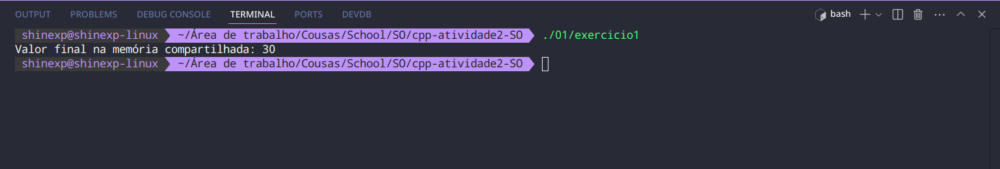
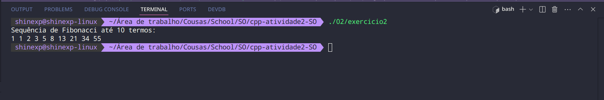
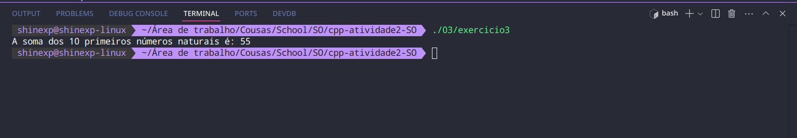
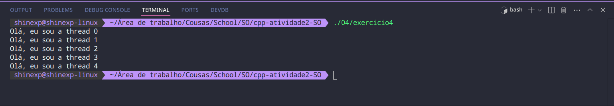

# Relatório

### Exercício 01:
Modifique o código para fazer com que dois processos filhos alterem uma memória compartilhada contendo um inteiro. Faça o processo pai esperar por seus dois filhos para depois imprimir o valor da variável na tela. Dica: olhe o código do exercício 3 do Laboratório 1.

### O que foi feito:
Uma variável inteira foi criada e compartilhada entre os processos, iniciando com o valor 0. Os processos filhos foram gerados, e cada um deles incrementou o valor da variável compartilhada. Após a conclusão dos filhos, o processo pai imprime o valor atualizado da variável.

### Saída:
  
*Imagem 1: Saída do Exercício 01*

---

### Exercício 02:
Utilizando comunicação entre processos, crie um código que escreva a Sequência de Fibonacci, com o parâmetro `n` sendo uma variável global. A sequência deve ser gerada por um processo filho, mas impressa na tela pelo processo pai. Dica: olhe o código do desafio do Laboratório 1.

### O que foi feito:
Um ponteiro foi estabelecido para que os processos compartilhassem um array com tamanho `n`, onde `n` representa o comprimento da sequência. O processo filho preenche o array da Sequência de Fibonacci, começando com os termos 1 e 1. O processo pai aguarda a finalização do filho e imprime a sequência resultante.

### Saída:
  
*Imagem 2: Saída do Exercício 02*

---

### Exercício 03:
Usando comunicação entre processos, escreva um código que realiza a soma de `n` números naturais, sendo `n` uma variável global. Cada processo deve fazer apenas a soma de dois números e o resultado final deve ser retornado pelo primeiro processo. Por exemplo, o processo 1 deve fazer a soma de 0+1, o processo 2 vai pegar esse resultado e somar com 2, e assim por diante.

### O que foi feito:
Um ponteiro foi estabelecido para que os processos compartilhassem uma variável inteira na memória, que armazena a soma acumulada dos números naturais de 0 até `n`. O processo pai inicializa essa variável em 0. Para cada número de 1 até `n`, um processo filho é criado, que soma seu respectivo número à soma acumulada. Após a execução de todos os processos filhos, o processo pai aguarda sua finalização e imprime o resultado da soma total.

### Saída:
  
*Imagem 3: Saída do Exercício 03*

---

### Exercício 04:
Comente a linha `pthread_join(threads[i],NULL)` no código acima e veja o que acontece. Qual o motivo da mudança no output? Faça modificações no código para obter novamente a saída original sem utilizar `pthread_join`. Dica: threads também podem dormir.

### O que foi feito:
Quando se comenta a linha `pthread_join(threads[i],NULL)`, o comportamento do programa muda porque a thread principal não espera mais as threads que ela criou terminarem. Ou seja, o programa (thread principal) pode terminar antes das threads concluírem sua execução, levando à perda da saída esperada ou execução incompleta das threads, além disso não é mantido a ordem de execução das threads levando a saídas não ordenadas.

Para conseguir um comportamento semelhante ao código original foi usando as funções `sleep` e `usleep`, com o uso da primeira sendo necessário para que haja a espera do fim das threads antes da thread principal, e o uso da segunda para que haja um pequeno atraso entre as threads dando então tempo à thread de executar antes de criar a próxima e por fim mantendo a ordem entre elas.

### Saída - Comentando `pthread_join`:
  
*Imagem 4.1: Saída do Exercício 04 - Comentando `pthread_join`*

### Saída - Usando `sleep` e `usleep`:
  
*Imagem 4.2: Saída do Exercício 04 - Usando `sleep` e `usleep`*

---

### Exercício 05:
Refaça o exercício 2 utilizando threads.

### O que foi feito:
Por se tratar de threads, não foi necessário configurar um espaço de memória compartilhada, um simples array foi usado ao invés disso. Desenvolvi a função `void *fibonacci(void *arg)`, que contém a lógica para calcular a sequência de Fibonacci e colocar os elementos dentro do array, permitindo que essa função seja passada para a thread. Após a criação e execução da thread, a thread principal executa um `pthread_join` para garantir a conclusão dos cálculos antes de imprimir o resultado.

### Saída:
  
*Imagem 5: Saída do Exercício 05*

---

### Exercício 06:
Refaça o exercício 3 utilizando threads.

### O que foi feito:
Por se tratar de threads, não foi necessário configurar um espaço de memória compartilhada; em vez disso, um simples array foi utilizado. Desenvolvi a função void `void *sum(void *arg)`, que contém a lógica para realizar a soma de um número e atualizar o valor acumulado no array. Após a criação e execução de cada thread, a thread principal chama pthread_join para garantir a conclusão dos cálculos antes de imprimir o resultado final.

### Saída:
  
*Imagem 6: Saída do Exercício 06*

---

### Observações Finais:
Nas instruções do laboratório, é solicitado que o aluno escolha quatro questões. Eu optei por fazer todas. Para resolver algumas dessas questões, adptei algumas coisas feitas durante o primeiro laboratório.
